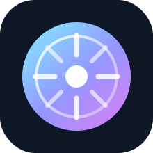

<p align="center">
  
</p>

<h1 align="center">AIOS</h1>

<p align="center">
  <strong>AI is not an app. AI is the operating-system interface.</strong>
</p>

<p align="center">
  <a href="README.md">English</a>
  ·
  <a href="README.zh-CN.md">简体中文</a>
  ·
  <a href="README.ja.md">日本語</a>
</p>

<p align="center">
  
</p>

## AIOS とは

AIOS は、AI ネイティブなオペレーティングシステムの実験的アーキテクチャです。

チャットボットでも、Web フロントエンドでも、Electron シェルでもありません。AIOS が探求しているのは、次のようなシステムモデルです。

```text
User intent
-> AIOS Core
-> Policy Kernel
-> Native App Invocation
-> User Confirmation
-> Audited Execution
```

ユーザーはアプリを開くところから始めるべきではありません。ユーザーは意図を伝え、OS が適切なネイティブアプリ、ツール、ポリシー、プレビュー、確認フローを呼び出すべきです。

## Core Idea

- AI はもう一つのアプリではなく、システムインターフェースです。
- アプリは存在し続けますが、意図によって呼び出されます。
- Agent は管理されたシステムプロセスです。
- Tool は制御されたシステム能力です。
- Policy は AI の行動境界です。
- Evidence と Audit はシステムの信頼性の一部です。

## Technology Direction

```text
Rust       -> AIOS Core, Kernel, Runtime, Native Shell Model
WASM       -> Plugin sandbox and portable controlled tools
C / C++    -> Low-level platform and driver interop when necessary
Python     -> Model experiments outside the trusted core
```

HTML/CSS/JS のプロトタイプは視覚的な参考資料であり、最終的な OS Shell 技術ではありません。

## Current Status

This repository currently contains:

- Rust workspace scaffold
- core system object types
- Goal Kernel prototype
- Policy Kernel prototype
- Agent Runtime prototype
- Native Shell state model
- Native Platform abstraction
- Tool ABI and workflow schemas
- homepage concept preview
- architecture and roadmap documents

## Quick Start

Install Rust, then run:

```bash
cargo test --workspace
```

Run the CLI prototype:

```bash
cargo run -p aios-cli -- "Tell Zhang San dinner is waxiang chicken tonight"
```

## Contributing

AIOS is meant to be co-created.

Good contribution areas:

- kernel and runtime design
- native shell model
- platform adapters
- policy and security model
- Tool ABI and plugin sandbox
- real-world intent scenarios
- architecture documentation
- visual system design

Issues and pull requests are welcome.

## License

MIT License.

