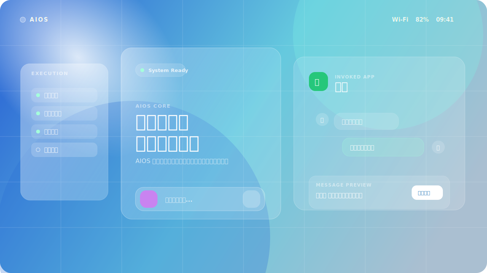

# AIOS

> AI is not an app. AI is the operating-system interface.

**AIOS 是一个共创中的 AI 原生操作系统项目。**

它不是聊天助手，不是网页前端，也不是套壳应用。AIOS 想探索的是一种新的系统形态：

```text
用户不再先打开应用。
用户表达目标。
AIOS 理解意图，调用原生应用、系统工具、权限策略与确认界面。
用户只确认结果。
系统完成执行，并留下可审计记录。
```

<p align="center">
  
</p>

## 一句话

**AIOS = 以 AI 为界面中心、以意图为入口、以原生应用调用为执行方式、以权限和审计为安全边界的新型操作系统。**

例如：

```text
告诉张三，今晚吃瓦香鸡
```

传统系统里，用户要：

```text
打开微信 -> 找到张三 -> 输入消息 -> 检查内容 -> 点击发送
```

AIOS 里，系统应该：

```text
理解意图
-> 调用聊天应用
-> 展示消息预览
-> 等待用户确认
-> 发送消息
-> 记录审计
```

用户不是从应用开始，而是从目标开始。

## 为什么要做

今天的操作系统仍然是应用中心的：

```text
User -> App -> Window -> Button -> Result
```

AIOS 想把它改成目标中心：

```text
User -> Intent -> AIOS Core -> Native App / Tool -> Confirmation -> Result
```

这意味着：

- 应用仍然存在，但不再是第一入口。
- AI 不是一个 App，而是系统级交互界面。
- Agent 不是聊天功能，而是系统进程。
- Tool 不是插件按钮，而是受控系统能力。
- Policy 不是登录权限，而是 AI 行为边界。
- Evidence 和 Audit 是系统可信度的一部分。

## 这个项目想共创什么

我们要共同探索一套 AIOS 的原生底层架构：

```text
AIOS Core
├─ Goal Kernel          意图和目标内核
├─ Policy Kernel        权限、风险、审批
├─ Agent Runtime        Agent 进程运行时
├─ Tool Runtime         受控工具调用
├─ Native Shell         原生系统界面模型
├─ Platform Adapter     Windows / macOS / Linux / Mobile 抽象
├─ Artifact Service     产物管理
└─ Audit Service        审计记录
```

目标不是马上替代 Windows、macOS、Linux、Android 或 iOS，而是先把核心闭环跑通：

```text
Intent
-> Plan
-> Agent Runtime
-> Policy Check
-> Native App Invocation
-> User Confirmation
-> Audited Execution
```

## 当前状态

这是一个早期原型仓库，已经包含：

- Rust workspace 原生底层骨架
- AIOS Core 基础类型
- Goal Kernel / Policy Kernel / Agent Runtime 雏形
- Native Shell 状态模型
- Platform Adapter 抽象
- Tool ABI 和系统对象 schema
- 首页视觉参考图
- AIOS Intent Shell 静态视觉参考稿
- 架构、路线图和设计文档

注意：

```text
prototypes/shell-ui 只是视觉参考，不是最终产品技术路线。
最终方向是原生 Shell，不是 HTML 页面。
```

## 技术路线

主线技术选择：

```text
Rust       -> AIOS Core / Kernel / Runtime / Native Shell Model
WASM       -> 插件沙箱与可移植工具能力
Python     -> 模型实验与评测，不进入可信核心
C / C++    -> 必要的系统、驱动、平台 API 互操作
```

非主线：

```text
HTML / CSS / JS 只用于视觉参考和沟通设计，不作为 OS Shell 架构。
Node 不作为核心构建依赖。
Electron / WebView 不作为最终 OS 界面目标。
```

## 项目结构

```text
AIOS
├─ crates/
│  ├─ aios-types
│  ├─ aios-goal-kernel
│  ├─ aios-policy-kernel
│  ├─ aios-agent-runtime
│  ├─ aios-platform
│  ├─ aios-native-shell
│  ├─ aios-daemon
│  └─ aios-cli
├─ specs/
│  ├─ objects
│  ├─ policy
│  ├─ tool-abi
│  └─ workflow
├─ docs/
├─ prototypes/
├─ plugins/
├─ services/
├─ examples/
└─ tests/
```

## 首页概念

AIOS 的首页不是网站，不是桌面图标墙，也不是聊天窗口。

它应该是一个系统级意图界面：

- 中心是 AIOS Core。
- 用户输入或说出目标。
- 系统自动调起对应原生应用。
- 应用界面以“待确认结果”的形式出现。
- 左右显示执行、权限、证据、审计上下文。

更多说明见 [Homepage Effect](docs/HOMEPAGE_EFFECT.md) 和 [UI Reference](docs/UI_REFERENCE.md)。

## 可参与方向

如果你也对 AIOS 感兴趣，可以从这些方向参与：

- **Kernel**：Goal Kernel、Policy Kernel、Context Core
- **Runtime**：Agent Runtime、Tool Runtime、Workflow Runtime
- **Native Shell**：原生 Shell 状态模型、窗口/浮窗/确认界面
- **Platform**：Windows、macOS、Linux、Android、iOS 平台适配
- **Security**：权限、审批、审计、沙箱、回滚
- **Plugin ABI**：受控工具协议、WASM 插件沙箱
- **Design**：AIOS 首页、意图界面、应用调用展示
- **Docs**：架构文档、路线图、概念解释、示例流程

## 路线图

### Phase 0: Concept Scaffold

- [x] 定义 AIOS 核心理念
- [x] 搭建 Rust workspace
- [x] 建立核心对象模型
- [x] 建立首页视觉方向
- [x] 明确原生 OS 路线

### Phase 1: Native Core MVP

- [ ] 完善 Goal / Task / Plan 类型
- [ ] 实现最小 Goal Kernel
- [ ] 实现 Policy Kernel 决策模型
- [ ] 实现 Agent Runtime 生命周期
- [ ] 实现 Tool ABI 注册与调用模型

### Phase 2: Intent Invocation Demo

- [ ] 输入自然语言意图
- [ ] 解析为系统目标
- [ ] 选择原生应用目标
- [ ] 展示待确认界面
- [ ] 用户确认后执行
- [ ] 生成审计记录

### Phase 3: Native Shell

- [ ] Windows 原生壳实验
- [ ] Linux 原生壳实验
- [ ] macOS 原生壳实验
- [ ] 跨设备 Shell 状态同步

## 本地开发

需要 Rust 工具链。

```bash
cargo test --workspace
```

运行 CLI 雏形：

```bash
cargo run -p aios-cli -- "Tell Zhang San dinner is waxiang chicken"
```

运行本地 daemon 雏形：

```bash
cargo run -p aios-daemon
```

## 关键文档

- [Architecture](docs/ARCHITECTURE.md)
- [Native OS Strategy](docs/NATIVE_OS_STRATEGY.md)
- [Technology Stack](docs/TECH_STACK.md)
- [Core Objects](docs/CORE_OBJECTS.md)
- [Final Project Structure](docs/FINAL_PROJECT_STRUCTURE.md)
- [Adaptive Shell](docs/ADAPTIVE_SHELL.md)
- [Homepage Effect](docs/HOMEPAGE_EFFECT.md)
- [MVP Roadmap](docs/MVP_ROADMAP.md)

## 共创 AIOS

AIOS 还非常早期，但方向足够清晰：

```text
下一代操作系统，不应该只是多一个 AI 助手。
它应该让 AI 成为系统级界面，让应用成为可被意图调用的能力。
```

如果你也相信这个方向，欢迎一起共创：

- 提 Issue 讨论架构
- 提 PR 完善核心模块
- 设计新的首页交互
- 实现平台适配
- 写下你认为 AIOS 应该支持的真实场景

**让我们一起把 AIOS 从一个想法，推进成一个真正的系统。**
